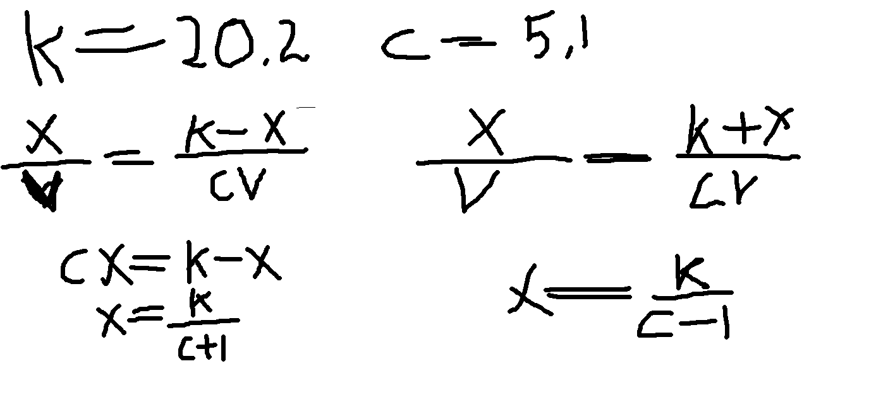
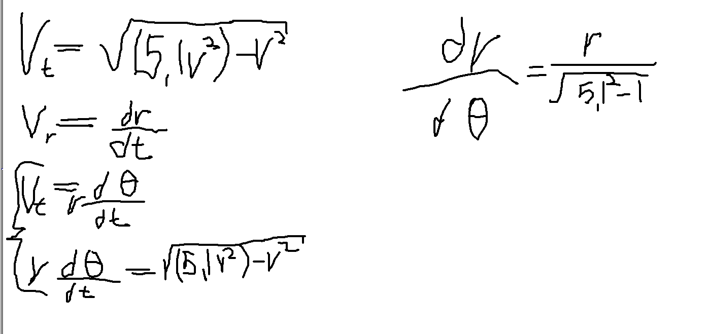
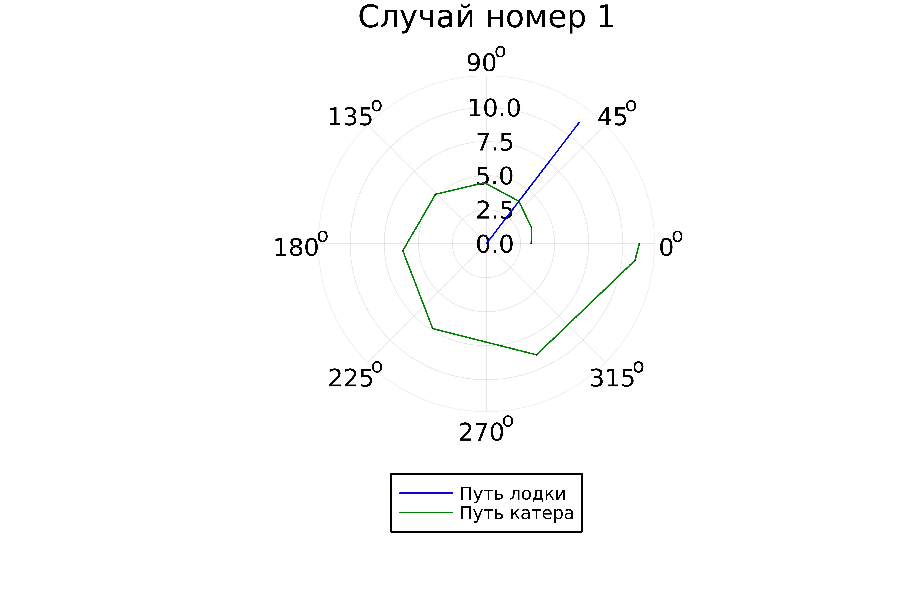
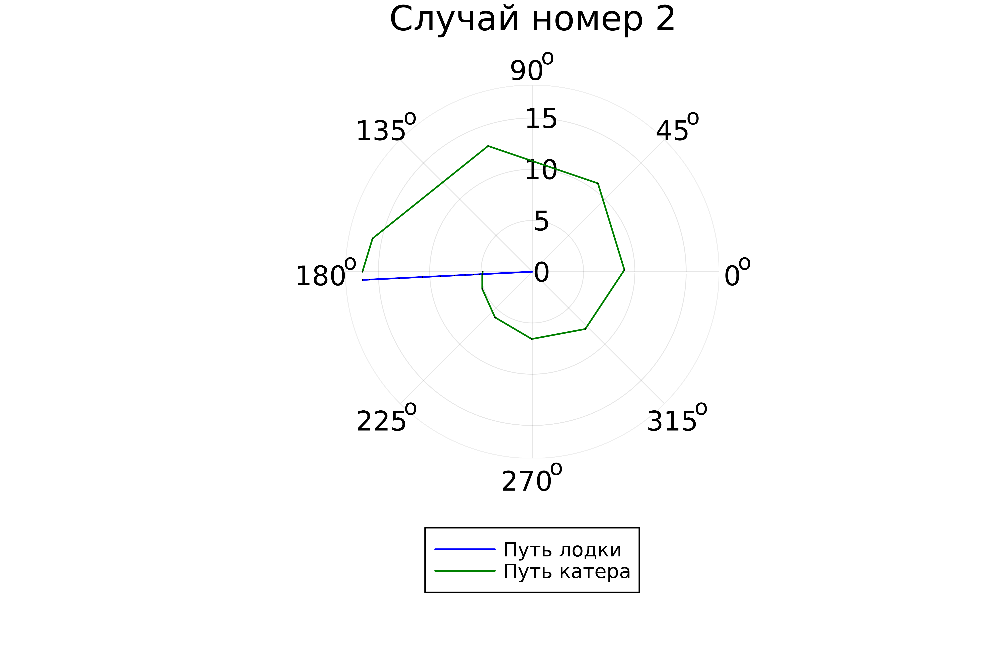

# РОССИЙСКИЙ УНИВЕРСИТЕТ ДРУЖБЫ НАРОДОВ

### Факультет физико-математических и естественных наук 

<br/>
<br/>
<br/>
<br/>

ОТЧЕТ
ПО ЛАБОРАТОРНОЙ РАБОТЕ №2
===============
## Моделирование задачи "Погоня"

<br/>
<br/>
<br/>
<br/>
<br/>
<br/>
<br/>
<br/>
дисциплина:  Математическое моделирование

Студент: Петрушов Дмитрий Сергеевич

Группа: НПИбд-01-21

<br/>
<br/>
<br/>
<br/>

## Введение.
### Цель работы.
Разработать решение для задачи "Погоня" с помощью математического моделирования на языке Julia.

### Описание задания
На море в тумане катер береговой охраны преследует лодку браконьеров.
Через определенный промежуток времени туман рассеивается, и лодка обнаруживается на расстоянии 19.5 км от катера. Затем лодка снова скрывается в тумане и уходит прямолинейно в неизвестном направлении. Известно, что скорость катера в 4.9 раза больше скорости браконьерской лодки.

### Задачи.
1. Записать уравнение, описывающее движение катера, с начальными условиями для двух случаев (в зависимости от расположения катера относительно лодки в начальный момент времени). 
2. Построить траекторию движения катера и лодки для двух случаев.
3. Найти точку пересечения траектории катера и лодки. 

## Ход работы
### 1 задание
---
Для начала запишем уравнение, описывающее движение катера, с начальными условиями для 2-х случаев:
Определим такие условия:



Для того чтобы катер и лодка всё время были на одном расстоянии от полюса $\Theta$, катер береговой охраны должен двигаться некоторое время прямолинейно, пока не окажется на том же расстоянии от полюса, что и лодка браконьеров. После этого катер береговой охраны должен двигаться вокруг полюса удаляясь от него с той же скоростью, что и лодка 
браконьеров.

Теперь, чтобы найти $x$ (расстояние, после которого катер начнет двигаться вокруг полюса), составим уравнение. Установим, что ререз время $t$ катер и лодка окажутся на одном расстоянии $x$ от полюса $\Theta$, таким образом за это время $t$ лодка пройдёт $x$, а катер $19.5-x$ или $19.5+x$, исходя из начального положения катера относительно $\Theta$. Время, за которое они пройдут это расстояние, вычисляется как $x/v$ или $19.5-x/4.9v$ или $19.5+x/4.9v$, соответсвенно. Получаем эти уравнения:

<br/>
И их решения для 2-х случаев:


После того, как катер береговой охраны окажется на одном расстоянии от полюса, что и лодка, он должен сменить прямолинейную траекторию и начать двигаться вокруг полюса удаляясь от него со скоростью лодки v.
Для этого разобьём скорость катера на $v_\gamma$ - радиальную скорость (скорость, с которой катер удаляется от полюса, $v_\gamma=\frac{dr}{dt}$) и $v_\tau$ - тангенциальную скорость (линейная скорость вращения катера относительно полюса, $v_\tau=r\frac{d\Theta}{dt}$). При этом необходимо, чтобы скорость $v_\gamma$ была равна скорости лодки, поэтому:


А сейчас построим траекторию движения катера и лодки для двух случаев, написав алгоритм для этого:

```
using DifferentialEquations

const a = 20.3
const n = 5.2

const r0 = a/(n + 1)
const r0_2 = a/(n - 1)

const T = (0, 2*pi)
const T_2 = (-pi, pi)

function F(u, p, t)
    return u / sqrt(n*n - 1)
end


problem = ODEProblem(F, r0, T)


result = solve(problem, abstol=1e-8, reltol=1e-8)
@show result.u
@show result.t

dxR = rand(1:size(result.t)[1])
rAngles = [result.t[dxR] for i in 1:size(result.t)[1]]


plt = plot(proj=:polar, aspect_ratio=:equal, dpi = 1000, legend=true, bg=:white)


plot!(plt, xlabel="theta", ylabel="r(t)", title="Случай номер 1", legend=:outerbottom)
plot!(plt, [rAngles[1], rAngles[2]], [0.0, result.u[size(result.u)[1]]], label="Путь лодки", color=:blue, lw=1)
scatter!(plt, rAngles, result.u, label="", mc=:blue, ms=0.0005)
plot!(plt, result.t, result.u, xlabel="theta", ylabel="r(t)", label="Путь катера", color=:green, lw=1)
scatter!(plt, result.t, result.u, label="", mc=:green, ms=0.0005)

savefig(plt, "1.png")

problem = ODEProblem(F, r0_2 , T_2)
result = solve(problem, abstol=1e-8, reltol=1e-8)
dxR = rand(1:size(result.t)[1])
rAngles = [result.t[dxR] for i in 1:size(result.t)[1]]


plt1 = plot(proj=:polar, aspect_ratio=:equal, dpi = 1000, legend=true, bg=:white)


plot!(plt1, xlabel="theta", ylabel="r(t)", title="Случай номер 2", legend=:outerbottom)
plot!(plt1, [rAngles[1], rAngles[2]], [0.0, result.u[size(result.u)[1]]], label="Путь лодки", color=:blue, lw=1)
scatter!(plt1, rAngles, result.u, label="", mc=:blue, ms=0.0005)
plot!(plt1, result.t, result.u, xlabel="theta", ylabel="r(t)", label="Путь катера", color=:green, lw=1)
scatter!(plt1, result.t, result.u, label="", mc=:green, ms=0.0005)

savefig(plt1, "2.png")

```

<br/>*РИС.1(Для 1-го случая)*

<br/>*РИС.2(Для 2-го случая)*
---
## Заключение
В ходе продеданной лабораторной работы мной были усвоены навыки решения задачи математического моделирования с применением языка программирования для работы с математическими вычислениями Julia.
