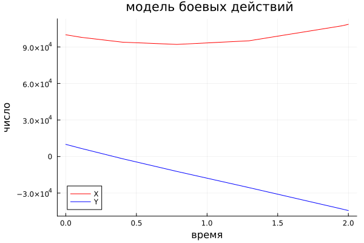
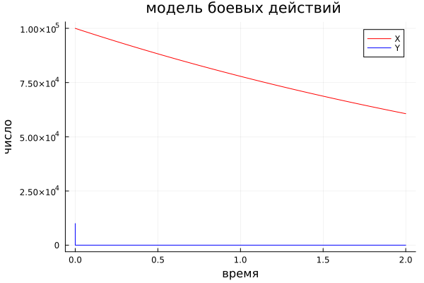

# РОССИЙСКИЙ УНИВЕРСИТЕТ ДРУЖБЫ НАРОДОВ

### Факультет физико-математических и естественных наук 

<br/>
<br/>
<br/>
<br/>

##ОТЧЕТ
##ПО ЛАБОРАТОРНОЙ РАБОТЕ №3
# Модель боевых действий

<br/>
<br/>
<br/>
<br/>
<br/>
<br/>
<br/>
<br/>
дисциплина:  Математическое моделирование

Студент: Петрушов Дмитрий Сергеевич

Группа: НПИбд-01-21

<br/>
<br/>
<br/>
<br/>

## Введение.
### Цель работы.
Разработать решение для модели боевых действий с помощью математического моделирования на языках Julia и OpenModelica.

### Описание задания
Между страной $X$ и страной $Y$ идет война. Численность состава войск 
исчисляется от начала войны, и являются временными функциями 
$x(t)$ и $y(t)$. В начальный момент времени страна $X$ имеет армию численностью $23 450$ человек, а в распоряжении страны $Y$ армия численностью в $11 250$ человек. Для упрощения модели считаем, что коэффициенты $a$, $b$, $c$, $h$ постоянны. Также считаем $P(t)$ и $Q(t)$ непрерывные функции.

Постройте графики изменения численности войск армии $Х$ и армии $Y$ для 
следующих случаев:

1. Модель боевых действий между регулярными войсками
2. Модель ведение боевых действий с участием регулярных войск и 
партизанских отрядов  
### Задачи.
1. Реализовать модель и построить графики боевых действий на языке Julia для обоих случаев. 

## Ход работы
### 1 задание
Запишем решение для симуляции боевых действий для 1-го и 2-го варианта на языке Julia (рис.1, рис.2):

```
using Plots;
using DifferentialEquations;
function F(du,u,p,t)
du[1]= -0.12*u[1]-0.9*u[2]+ abs(sin(t))
du[2]= -0.3*u[1]-0.1*u[2]+ abs(cos(t))
end
const N= Float64[100000, 10000]
const time=[0.0, 2.0]
x= ODEProblem(F,N, time)
sol= solve(x, dt=0.0001)
a1= [u[1] for u in sol.u]
a2= [u[2] for u in sol.u]
T= [ t for t in sol.t]
mp= plot(xaxis= "время", yaxis = "число", label = ["x","y"], title= " модель боевых действий")
plot!(mp,T,a1, label= "X", color=:red)
plot!(mp,T,a2, label= "Y", color=:blue)

savefig(mp, "1.png")
```

<br/>*РИС.1(Для 1-го случая)*

```
using Plots;
using DifferentialEquations;
function F(du,u,p,t)
du[1]= -0.25*u[1]-0.96*u[2]+ abs(sin(2*t)+1)
du[2]= -0.25*u[1]*u[2]-0.3*u[2]+ abs(cos(20*t)+1)
end
const N= Float64[100000, 10000]
const time=[0.0, 2.0]
x= ODEProblem(F,N, time)
sol= solve(x, dt=0.0001)
a1= [u[1] for u in sol.u]
a2= [u[2] for u in sol.u]
T= [ t for t in sol.t]
mp= plot(xaxis= "время", yaxis = "число", label = ["x","y"], title= " модель боевых действий")
plot!(mp,T,a1, label= "X", color=:red)
plot!(mp,T,a2, label= "Y", color=:blue)

savefig(mp, "2.png")
```


<br/>*РИС.2(Для 2-го случая)*

Исходя из графиков, представленных на рис.1 и рис.2, можно утверждать, что армия $Y$ несёт поражение в каждом варианте боевых действий, что связано с большей численностью армии противника и значением коэффициента её эффективности.

## Заключение
В ходе продеданной лабораторной работы мной были усвоены навыки решения задачи математического моделирования с применением языков программирования для работы с математическими вычислениями Julia.
