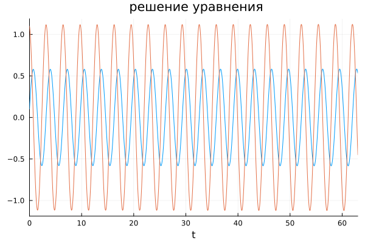
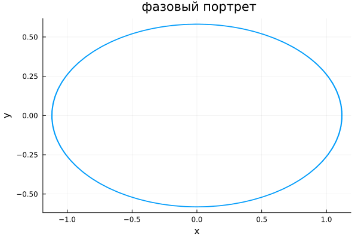
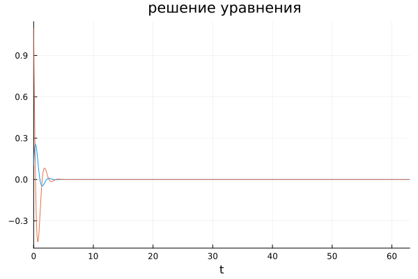
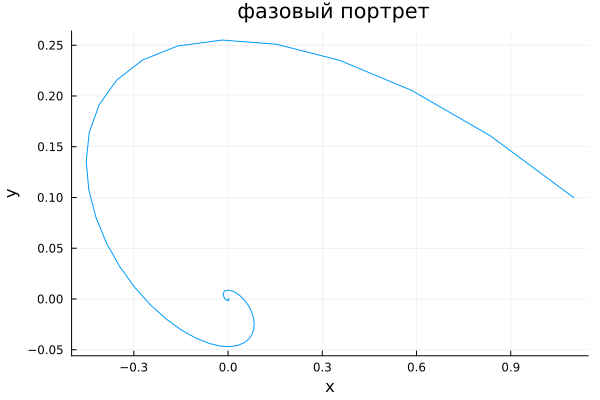
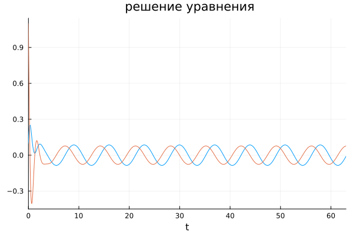
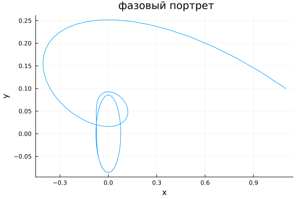

# РОССИЙСКИЙ УНИВЕРСИТЕТ ДРУЖБЫ НАРОДОВ

### Факультет физико-математических и естественных наук 

<br/>
<br/>
<br/>
<br/>

##ОТЧЕТ
###ПО ЛАБОРАТОРНОЙ РАБОТЕ №4

## Модель гармонических колебаний

<br/>
<br/>
<br/>
<br/>
<br/>
<br/>
<br/>
<br/>
дисциплина:  Математическое моделирование

Студент: Петрушов Дмитрий Сергеевич

Группа: НПИбд-01-21

<br/>
<br/>
<br/>
<br/>

## Введение.
### Цель работы.
Разработать решение для модели гармонических колебаний с помощью математического моделирования на языках Julia.

### Задачи.
 Реализовать модель и построить фазовый портрет гармонического осциллятора и график решения уравнения гармонического осциллятора на языке Julia для 3-х случаев. 

## Ход работы
### 1 задание

Запишем решение уравнения гармонического осциллятора для 1 случая на языке Julia (рис.1 - рис.2):

```
using Plots;
using DifferentialEquations;

function F(du,u,p,t)
a=p
du[1]=u[2]
du[2]= -a*u[1]
end
u0=[0.1,1.1]
p=3.7
t=(0.0, 63.0)
x= ODEProblem(F,u0,t,p)
sol= solve(x, dt=0.05)
gr()
plot(sol, xaxis= "t", lable= "", legend= false, title=" решение уравнения")
savefig("1,1.png")
plot(sol, vars=(2,1), xaxis= "x", yaxis="y", lable= "", legend= false, title=" фазовый портрет")
savefig("1,2.png")
```

<br/>*РИС.1(Для 1-го случая (без затуханий и без действий внешней силы))*

<br/>*РИС.2(Для 1-го случая (без затуханий и без действий внешней силы))*
### 2 задаине  
запишем решение уравнения гармонического осцилятора для 2 случая (рис.3-рис4)
```
using Plots;
using DifferentialEquations;

function F(du,u,p,t)
a, b=p
du[1]=u[2]
du[2]= -a*du[1]- b*u[1]
end
u0=[0.1,1.1]
p=[3, 10]
t=(0.0, 63.0)
x= ODEProblem(F,u0,t,p)
sol= solve(x, dt=0.05)
gr()
plot(sol, xaxis= "t", lable= "", legend= false, title=" решение уравнения")
savefig("2,1.png")
plot(sol, vars=(2,1), xaxis= "x", yaxis="y", lable= "", legend= false, title=" фазовый портрет")
savefig("2,2.png")
```

<br/>*РИС.3(Для 2-го случая (с затуханием и без действий внешней силы))*

<br/>*РИС.4(Для 2-го случая (с затуханием и без действий внешней силы))*
### 3 задание
```
using Plots;
using DifferentialEquations;

function F(du,u,p,t)
a,b=p
du[1]=u[2]
du[2]= -a*du[1]-b*u[1]+ 0.9*sin(0.9*t)
end
u0=[0.1,1.1]
p=[3,11]
t=(0.0, 63.0)
x= ODEProblem(F,u0,t,p)
sol= solve(x, dt=0.05)
gr()
plot(sol, xaxis= "t", lable= "", legend= false, title=" решение уравнения")
savefig("3,1.png")
plot(sol, vars=(2,1), xaxis= "x", yaxis="y", lable= "", legend= false, title=" фазовый портрет")
savefig("3,2.png")
```


<br/>*РИС.5(Для 3-го случая (с затуханием и при воздействии внешней силы))*


<br/>*РИС.6(Для 3-го случая (с затуханием и при воздействии внешней силы))*


## Заключение
В ходе продеданной лабораторной работы мной были усвоены навыки решения задачи математического моделирования с применением языков программирования для работы с математическими вычислениями Julia.
