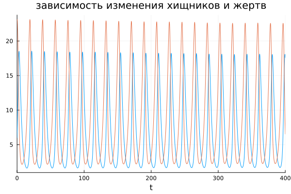
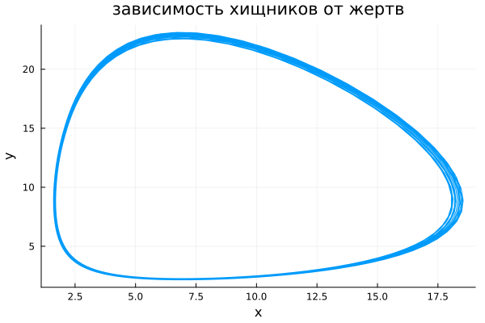
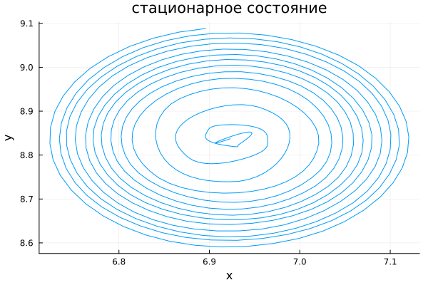

# РОССИЙСКИЙ УНИВЕРСИТЕТ ДРУЖБЫ НАРОДОВ

### Факультет физико-математических и естественных наук 

<br/>
<br/>
<br/>
<br/>

##ОТЧЕТ
###ПО ЛАБОРАТОРНОЙ РАБОТЕ №5
## Модель "хищник-жертва"

<br/>
<br/>
<br/>
<br/>
<br/>
<br/>
<br/>
<br/>
дисциплина:  Математическое моделирование

Студент: Петрушов Дмитрий Сергеевич

Группа: НПИбд-01-21

<br/>
<br/>
<br/>
<br/>

## Введение.
### Цель работы.
Разработать решение для модели "хищник-жертва" с помощью математического моделирования на языках Julia.

### Описание задания
Для модели «хищник-жертва»:

Постройте график зависимости численности хищников от численности жертв, 
а также графики изменения численности хищников и численности жертв при 
следующих начальных условиях: $x_0=6$, $y_0=23$. Найдите стационарное 
состояние системы.

### Задачи.
1. Реализовать модель и построить графики зависимости численности хищников от численности жертв и изменения численности хищников и численности жертв при начальных условиях: $x_0=6$, $y_0=23$ на языке Julia. 
2. Найти стационарное состояние системы на языках Julia.

## Ход работы
### 1 задание
---
Запишем решение для данной системы уравнений на языке Julia, чтобы построить графики зависимости численности хищников от численности жертв и изменения численности хищников и численности жертв(рис.1, рис.2):

```
using Plots;
using DifferentialEquations;

a= 0.38
b= 0.043
c=0.36
d=0.052

ss=[c/d,a/b]
x0=[6,23]
function F(du,u,p,t)
x,y=u
du[1]=-a*u[1]+b*u[1]*u[2]
du[2]=c*u[2]-d*u[1]*u[2]
end
t=[0.0,400.0]
x=ODEProblem(F,x0,t)
sol= solve(x,dt=0.1)
plot(sol, label="", legend=false,title= "зависимость изменения хищников и жертв")
savefig("1.png")
plot(sol,idxs=(1,2),xaxis="x",yaxis="y", label="", legend=false,title= "зависимость хищников от жер>
savefig("2.png")
v=ODEProblem(F,ss,t)
sol=solve(v, dt=0.1)
plot(sol,idxs=(1,2),xaxis="x",yaxis="y", label="", legend=false,title= "стационарное состояние")
savefig("3.png")
```


<br/>*РИС.1(график зависимости численности хищников от численности жертв)*


<br/>*РИС.2(график изменения численности хищников и численности жертв)*


### 2 задание
---
После этого найдём стационарное состояние системы и отобразим его в виде графика (рис. 3):
```
using Plots;
using DifferentialEquations;

a= 0.38
b= 0.043
c=0.36
d=0.052

ss=[c/d,a/b]
x0=[6,23]
function F(du,u,p,t)
x,y=u
du[1]=-a*u[1]+b*u[1]*u[2]
du[2]=c*u[2]-d*u[1]*u[2]
end
t=[0.0,400.0]
x=ODEProblem(F,x0,t)
sol= solve(x,dt=0.1)
plot(sol, label="", legend=false,title= "зависимость изменения хищников и жертв")
savefig("1.png")
plot(sol,idxs=(1,2),xaxis="x",yaxis="y", label="", legend=false,title= "зависимость хищников от жер>
savefig("2.png")
v=ODEProblem(F,ss,t)
sol=solve(v, dt=0.1)
plot(sol,idxs=(1,2),xaxis="x",yaxis="y", label="", legend=false,title= "стационарное состояние")
savefig("3.png")
```

<br/>*РИС.3(график стационарного состояния системы)*

## Заключение
В ходе продеданной лабораторной работы мной были усвоены навыки решения задачи математического моделирования с применением языков программирования для работы с математическими вычислениями Julia.
