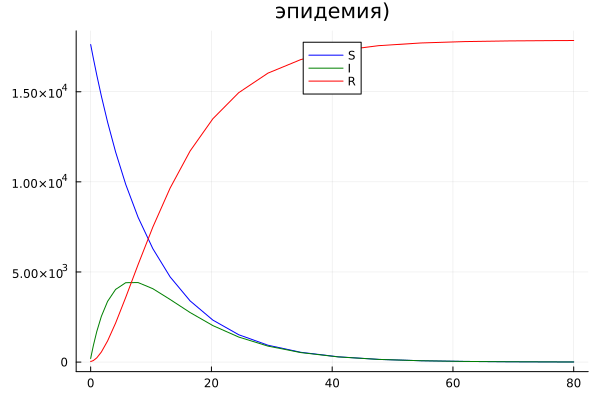
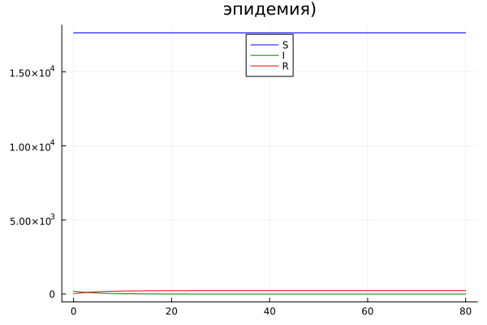

# РОССИЙСКИЙ УНИВЕРСИТЕТ ДРУЖБЫ НАРОДОВ

### Факультет физико-математических и естественных наук 

<br/>
<br/>
<br/>
<br/>

##ОТЧЕТ
###ПО ЛАБОРАТОРНОЙ РАБОТЕ №6
## Модель "эпидемия"

<br/>
<br/>
<br/>
<br/>
<br/>
<br/>
<br/>
<br/>
дисциплина:  Математическое моделирование

Студент: Петрушов Дмитрий Сергеевич

Группа: НПИбд-01-21

<br/>
<br/>
<br/>
<br/>

## Введение.
### Цель работы.
Разработать решение для модели "эпидемия" с помощью математического моделирования на языках Julia.

### Описание задания
На одном острове вспыхнула эпидемия. Известно, что из всех проживающих 
на острове $(N=17854)$ в момент начала эпидемии $(t=0)$ число заболевших людей 
(являющихся распространителями инфекции) $I(0)=199$, а число здоровых людей с 
иммунитетом к болезни $R(0)=35$. Таким образом, число людей восприимчивых к 
болезни, но пока здоровых, в начальный момент времени $S(0)=N-I(0)- R(0)$.

Постройте графики изменения числа особей в каждой из трех групп. 

Рассмотрите, как будет протекать эпидемия в случае: 
1) если $I(0)\leq I^*$
2) если $I(0)> I^*$

### Задачи.
1. Реализовать модель "эпидемии" и построить графики изменения числа особей в каждой из 3-х групп для обоих случаев на языке Julia. 

## Ход работы
### 1 задание
---
Реализуем данную модель на языке Julia и построим графики изменения численности каждой из 3-х групп в процессе эпидемии для обоих случаев: 
- в случае $I(0)\leq I^*$(начальная численность инфицированных меньше или равна критичнскому значению)(рис.2); 
- в случае $I(0)>I^*$(начальная численность инфицированных больше критического значения)(рис.1); 

```
using Plots;
using DifferentialEquations;

N = 17854
I0 = 199
R0 = 35
S0 = N - I0 - R0
a = 0.1
b = 0.2

function F(du, u, p, t)
    S, I, R = u
    du[1] = -a*u[1]
    du[2] = a*u[1] -b * u[2]
    du[3] = b * u[2]
end

x0 = [S0, I0, R0]
ts = (0.0, 80.0)

x = ODEProblem(F, x0, ts)
sol = solve(x, dt = 0.1)

S = [u[1] for u in sol.u]
I = [u[2] for u in sol.u]
R = [u[3] for u in sol.u]
time = [t for t in sol.t]

plot(time, S, label = "S", color = :blue, legend = :top, title = "эпидемия)")
plot!(time, I, label = "I", color = :green)
plot!(time, R, label = "R", color = :red)
savefig("2.png")
```


<br/>*РИС.1(протекание эпидемии при 2-м сценарии)*

```
using Plots;
using DifferentialEquations;

N = 17854
I0 = 199
R0 = 35
S0 = N - I0 - R0
a = 0.1
b = 0.2

function F(du, u, p, t)
    S, I, R = u
    du[1] = 0
    du[2] = -b * u[2]
    du[3] = b * u[2]
end

x0 = [S0, I0, R0]
ts = (0.0, 80.0)

x = ODEProblem(F, x0, ts)
sol = solve(x, dt = 0.1)

S = [u[1] for u in sol.u]
I = [u[2] for u in sol.u]
R = [u[3] for u in sol.u]
time = [t for t in sol.t]

plot(time, S, label = "S", color = :blue, legend = :top, title = "эпидемия)")
plot!(time, I, label = "I", color = :green)
plot!(time, R, label = "R", color = :red)
savefig("1.png")
```


<br/>*РИС.2(протекание эпидемии при 1-м сценарии)*

Исходя из данных, полученных от графиков на рис.1, рис.2, при таких коэффициентах заболеваемости и выздоровления в 1-м случае мы можем наблюдать быстрые рост и падение числа людей с иммунитетом и инфицированных соответственно. При этом количество здоровых, но восприимчивых к болезни людей остаётся неизменных напротяжении всей эпидемии по причине того, что в такой модели заражённые изолированы и не могут заражать здоровых людей.

Тем не менее, во 2-й модели можно увидеть иное развитие эпидемии. При реализации такой модели здоровые люди могут быть заражены инфицированы, что и видно на графике: быстрый рост инфицированных, стремительное падение числа восприимчивых к болезни и соответствующий рост количества переболевших, то есть людей с иммунитетом.

## Заключение
В ходе продеданной лабораторной работы мной были усвоены навыки решения задачи математического моделирования с применением языков программирования для работы с математическими вычислениями Julia.
