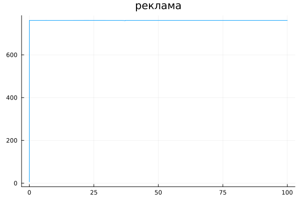

# РОССИЙСКИЙ УНИВЕРСИТЕТ ДРУЖБЫ НАРОДОВ

### Факультет физико-математических и естественных наук 

<br/>
<br/>
<br/>
<br/>

##ОТЧЕТ
###ПО ЛАБОРАТОРНОЙ РАБОТЕ №7

## Модель "эффективность рекламы"

<br/>
<br/>
<br/>
<br/>
<br/>
<br/>
<br/>
<br/>
дисциплина:  Математическое моделирование

Студент: Петрушов Дмитрий Сергеевич

Группа: НПИбд-01-21

<br/>
<br/>
<br/>
<br/>

## Введение.
### Цель работы.
Разработать решение для модели "эффективность рекламы" с помощью математического моделирования на языках Julia.

### Описание задания
Постройте график распространения рекламы, математическая модель которой описывается 
следующим уравнением:

1. $\frac{dn}{dt}=(082.+0.00003n(t))(N-n(t))$
2. $\frac{dn}{dt}=(0.00003+082.n(t))(N-n(t))$
3. $\frac{dn}{dt}=(0.2sin(t)+0.8cos(t)n(t))(N-n(t))$

При этом объем аудитории $N=761$, в начальный момент о товаре знает 6 человек.

### Задачи.
1. Реализовать модель "эффективность рекламы" и построить графики распространения рекламы для всех 3-х случаев на языке Julia. 

## Ход работы
### 1 задание
---
Реализуем данную модель на языке Julia и построим графики распространения рекламы для всех 3-х случаев(рис.1 - рис.3): 

```
using Plots;
using DifferentialEquations;
N=761
N0=6

function F(du,u,p,t)
(n)=u
du[1]=(0.82+0.00003*u[1])*(N-u[1])
end
x0=[N0]
ts=(0.0,100.0)
x=ODEProblem(F,x0,ts)
sol=solve(x, dt=0.1)
n=[u[1] for u in sol.u]
T=[t for t in sol.t]
plot(T,n,legend=false,title="реклама")
savefig("1.png")
```

<br/>*РИС.1(распространение рекламы при 1-м сценарии)*

```
using Plots
using DifferentialEquations

N = 761
n0 = 6

function ode_fn(du, u, p, t)
    (n) = u
    du[1] = (0.00003 + 0.82*u[1])*(N - u[1])
end

v0 = [n0]
tspan = (0.0, 0.1)
prob = ODEProblem(ode_fn, v0, tspan)
sol = solve(prob)
n = [u[1] for u in sol.u]
T = [t for t in sol.t]

max_dn = 0;
max_dn_t = 0;
max_dn_n = 0;
for (i, t) in enumerate(T)
    if sol(t, Val{1})[1] > max_dn
        global max_dn = sol(t, Val{1})[1]
        global max_dn_t = t
        global max_dn_n = n[i]
    end
end

plt = plot(
  dpi = 600,
  title = " рекламa ",
  legend = false)
plot!(
  plt,
  T,
  n,
  color = :red)
plot!(
  plt,
  [max_dn_t],
  [max_dn_n],
  seriestype = :scatter,
  color = :red)

savefig(plt, "2.png")
```

<br/>*РИС.2(распространение рекламы при 2-м сценарии)*

```
using Plots;
using DifferentialEquations;
N=761
N0=6

function F(du,u,p,t)
(n)=u
du[1]=(0.2*sin(t)+0.8*cos(t)*u[1])*(N-u[1])
end
x0=[N0]
ts=(0.0,100.0)
x=ODEProblem(F,x0,ts)
sol=solve(x, dt=0.1)
n=[u[1] for u in sol.u]
T=[t for t in sol.t]
plot(T,n,legend=false,title="реклама")
savefig("3.png")
```

<br/>*РИС.3(распространение рекламы при 3-м сценарии)*

мы можем видеть, что 2 модель более продуктивна. Так же мы можем видеть точку, обозначающую наибольшую эффективность рекламы

## Заключение
В ходе продеданной лабораторной работы мной были усвоены навыки решения задачи математического моделирования с применением языков программирования для работы с математическими вычислениями Julia.
