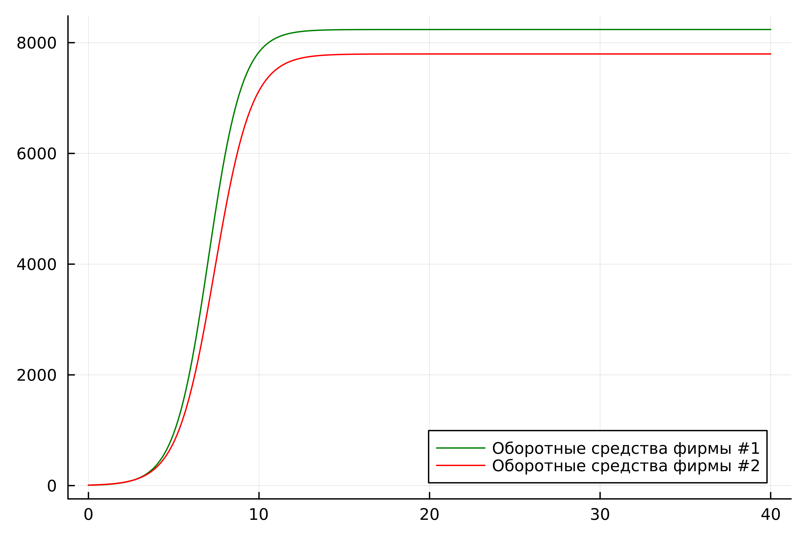
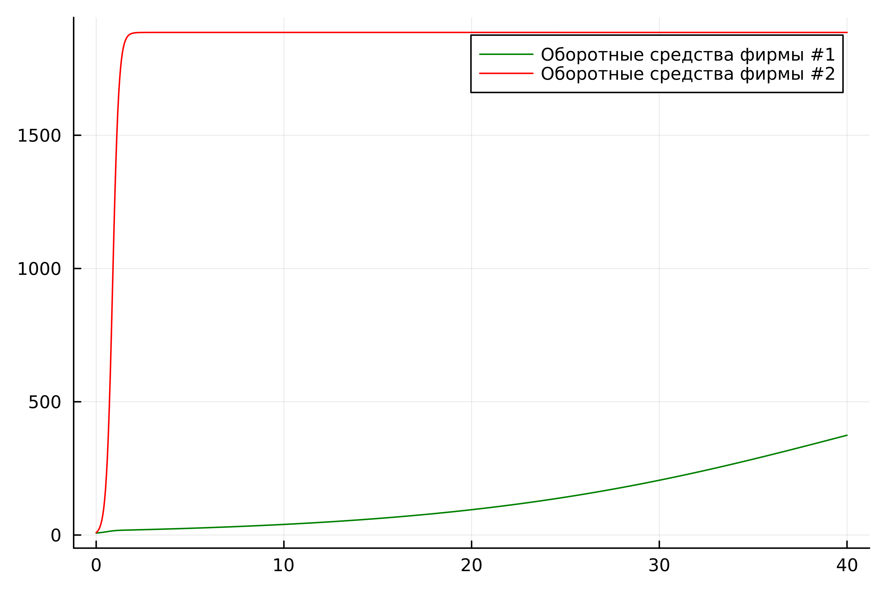

# РОССИЙСКИЙ УНИВЕРСИТЕТ ДРУЖБЫ НАРОДОВ

### Факультет физико-математических и естественных наук 

<br/>
<br/>
<br/>
<br/>

ОТЧЕТ
ПО ЛАБОРАТОРНОЙ РАБОТЕ №8
===============
## Модель "конкуренция двух фирм"

<br/>
<br/>
<br/>
<br/>
<br/>
<br/>
<br/>
<br/>
дисциплина:  Математическое моделирование

Студент: Петрушов Дмитрий Сергеевич

Группа: НПИбд-01-21

<br/>
<br/>
<br/>
<br/>

## Введение.
### Цель работы.
Разработать решение для модели "эффективность рекламы" с помощью математического моделирования на языках Julia.

### Описание задания
Случай 1. Рассмотрим две фирмы, производящие взаимозаменяемые товары 
одинакового качества и находящиеся в одной рыночной нише. Считаем, что в рамках 
нашей модели конкурентная борьба ведётся только рыночными методами. То есть, 
конкуренты могут влиять на противника путем изменения параметров своего 
производства: себестоимость, время цикла, но не могут прямо вмешиваться в 
ситуацию на рынке («назначать» цену или влиять на потребителей каким-либо иным 
способом.) Будем считать, что постоянные издержки пренебрежимо малы, и в 
модели учитывать не будем. В этом случае динамика изменения объемов продаж 
фирмы 1 и фирмы 2 описывается следующей системой уравнений:

$\frac{dM_1}{d\Theta}=M_1-\frac{b}{c_1}M_1M_2-\frac{a_1}{c_1}M_1^2$

$\frac{dM_2}{d\Theta}=\frac{c_2}{c_1}M_2-\frac{b}{c_1}M_1M_2-\frac{a_2}{c_1}M_2^2$

где $a_1=\frac{p_{cr}}{\tau_1^2\widetilde{p_1}^2Nq}$,
$a_2=\frac{p_{cr}}{\tau_2^2\widetilde{p_2}^2Nq}$,
$b=\frac{p_{cr}}{\tau_1^2\widetilde{p_1}^2\tau_2^2\widetilde{p_2}^2Nq}$,
$c_1=\frac{p_{cr}-\widetilde{p_1}}{\tau_1\widetilde{p_1}}$,
$c_2=\frac{p_{cr}-\widetilde{p_2}}{\tau_2\widetilde{p_2}}$.

Также введена нормировка $t=c_1\Theta$.

Случай 2. Рассмотрим модель, когда, помимо экономического фактора
влияния (изменение себестоимости, производственного цикла, использование 
кредита и т.п.), используются еще и социально-психологические факторы –
формирование общественного предпочтения одного товара другому, не зависимо от 
их качества и цены. В этом случае взаимодействие двух фирм будет зависеть друг 
от друга, соответственно коэффициент перед 
$M_1M_2$ будет отличаться. Пусть в рамках рассматриваемой модели динамика изменения объемов продаж фирмы 1 и фирмы 2 описывается следующей системой уравнений:

$\frac{dM_1}{d\Theta}=M_1-(\frac{b}{c_1}+0.00069)M_1M_2-\frac{a_1}{c_1}M_1^2$

$\frac{dM_2}{d\Theta}=\frac{c_2}{c_1}M_2-\frac{b}{c_1}M_1M_2-\frac{a_2}{c_1}M_2^2$


Обозначения:

$N$ - число потребителей производимого продукта.

$τ$ - длительность производственного цикла

$p$ - рыночная цена товара

$\tilde{p}$ – себестоимость продукта, то есть переменные издержки на производство единицы 
продукции.

$q$ - максимальная потребность одного человека в продукте в единицу времени

$\Theta=\frac{t}{c_1}$ - безразмерное время

1. Постройте графики изменения оборотных средств фирмы 1 и фирмы 2 без 
учета постоянных издержек и с веденной нормировкой для случая 1.
2. Постройте графики изменения оборотных средств фирмы 1 и фирмы 2 без 
учета постоянных издержек и с веденной нормировкой для случая 2.

### Задачи.
1. Реализовать модель "конкуренция двух фирм" и построить графики изменения оборотных средств фирмы 1 и фирмы 2 без учета постоянных издержек и с веденной нормировкой для случаев 1 и 2 на языке Julia. 

## Ход работы
### 1 задание
---
Реализуем данную модель на языке Julia и построим графики изменения оборотных средств фирмы 1 и фирмы 2 без учета постоянных издержек и с веденной нормировкой для 2-х случаев(рис.1 - рис.2): 

```
using Plots
using DifferentialEquations

kr = 42
t1 = 28
p1 = 8.1
t2 = 22
p2 = 10.5
N = 45
q = 1

a1 = kr / (t1 * t1 * p1 * p1 * N * q)
a2 = kr / (t2 * t2 * p2 * p2 * N *q)
b = kr / (t1 * t1 * t2 * t2 * p1 * p1 * p2 * p2 * N * q)
c1 = (kr - p1) / (t1 * p1)
c2 = (kr - p2) / (t2 * p2)


function ode_fn(du, u, p, t)
    M1, M2 = u
    du[1] = u[1] - b / c1*u[1] * u[2] - a1 / c1*u[1] * u[1]
    du[2] = c2 / c1*u[2] - b / c1*u[1] * u[2] - a2 / c1*u[2] * u[2]
end

v0 = [7.2, 9.1]
tspan = (0.0, 40.0)
prob = ODEProblem(ode_fn, v0, tspan)
sol = solve(prob, dtmax = 0.05)
M1 = [u[1] for u in sol.u]
M2 = [u[2] for u in sol.u]
T = [t for t in sol.t]

plt = plot(
  dpi = 600,
  legend = true)

plot!(plt, T, M1, label = "Оборотные средства фирмы #1", color = :green)

plot!(plt, T, M2, label = "Оборотные средства фирмы #2", color = :red)

savefig(plt, "1.png")
```

<br/>*РИС.1(изменения оборотных средств фирмы 1 и фирмы 2 для 1-го случая)*

Мы можем видеть, что в данной модели обе фирмы показали почти идентичный рост.  

### 2 задание
```using Plots
using DifferentialEquations

kr = 42
t1 = 28
p1 =  8.1
t2 = 22
p2 = 10/5
N = 45
q = 1

a1 = kr / (t1 * t1 * p1 * p1 * N * q)
a2 = kr / (t2 * t2 * p2 * p2 * N *q)
b = kr / (t1 * t1 * t2 * t2 * p1 * p1 * p2 * p2 * N * q)
c1 = (kr - p1) / (t1 * p1)
c2 = (kr - p2) / (t2 * p2)


function ode_fn(du, u, p, t)
    M1, M2 = u
    du[1] = u[1] - (b / c1 + 0.00048)*u[1] * u[2] - a1 / c1*u[1] * u[1]
    du[2] = c2 / c1*u[2] - b / c1*u[1] * u[2] - a2 / c1*u[2] * u[2]
end

v0 = [7.2, 9.1]
tspan = (0.0, 40.0)
prob = ODEProblem(ode_fn, v0, tspan)
sol = solve(prob, dtmax = 0.05)
M1 = [u[1] for u in sol.u]
M2 = [u[2] for u in sol.u]
T = [t for t in sol.t]

plt = plot(
  dpi = 600,
  legend = :topright)

plot!(plt, T, M1, label = "Оборотные средства фирмы #1", color = :green)

plot!(plt, T, M2, label = "Оборотные средства фирмы #2", color = :red)

savefig(plt, "2.png")
```


<br/>*РИС.2(изменения оборотных средств фирмы 1 и фирмы 2 для 2-го случая)*

Мы можем видеть, что в данной модели образовалась большая разница в объеме средств и 2 фирма вышла вперед.  
## Заключение
В ходе продеданной лабораторной работы мной были усвоены навыки решения задачи математического моделирования с применением языков программирования для работы с математическими вычислениями Julia.
